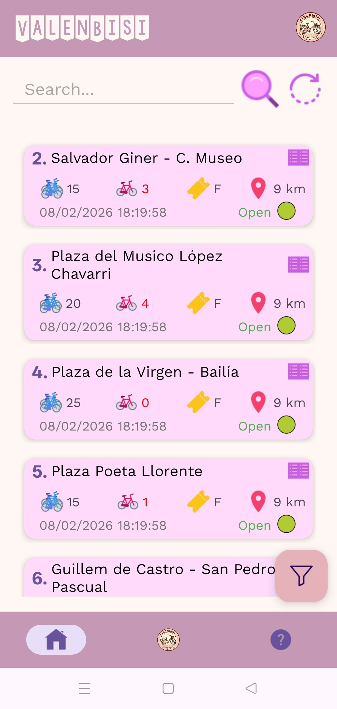
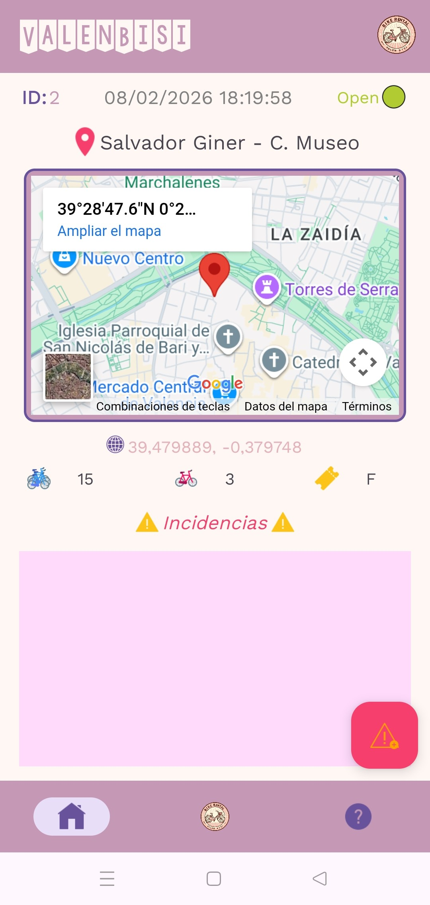
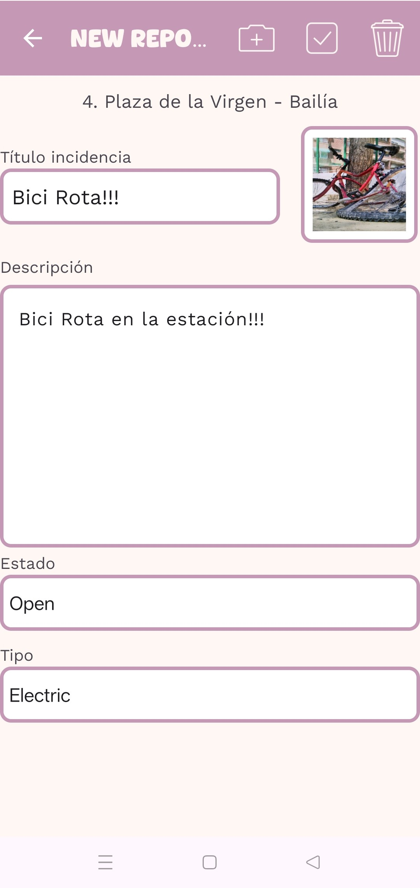

# ValenBisi - Monitorización de Estaciones en Tiempo Real

## Descripción
**ValenBisi** es una aplicación nativa para Android desarrollada en **Kotlin** que permite visualizar y gestionar el uso del servicio público de bicicletas de Valencia. 

La app centraliza la información de todas las estaciones de la ciudad, ofreciendo datos en tiempo real gracias a la integración con la **API del Ayuntamiento de Valencia**. Además de la consulta, la aplicación incorpora un módulo de **Gestión de Incidencias**, permitiendo a los usuarios reportar problemas mecánicos o de infraestructura.

<p align="center">
  
  
  
  
</p>


Este proyecto fue desarrollado para la asignatura de Aplicaciones de Dispositivos Móviles en la Universitat de València en 2024.

##  Funcionalidades Principales

### Exploración y Ubicación
* **Mapa Interactivo:** Visualización geolocalizada de todas las estaciones de ValenBisi.
* **Búsqueda Inteligente:** Filtros por nombre de calle o número de estación.
* **Geolocalización:** Función "Cerca de mí" que utiliza el GPS para mostrar las estaciones más próximas a la ubicación del usuario.

### Detalle de Estación (Tiempo Real)
Monitorización en vivo del estado de cada punto:
* Capacidad total de bornetas.
* Bicicletas disponibles vs. Huecos libres.
* Tipo de ticket aceptado en la estación.
* Estado operativo (Abierta/Cerrada).

### Reporte de Incidencias
Sistema para notificar percances (bicicleta rota, estación sin conexión, etc.):
* Creación de informes asociados a una estación específica.
* **Integración con Cámara:** Posibilidad de adjuntar una fotografía como prueba del incidente directamente desde la app.

## Arquitectura y Tecnologías
El proyecto sigue una arquitectura limpia, separando la capa de presentación de la lógica de negocio para facilitar el mantenimiento y la escalabilidad.

* **Lenguaje:** Kotlin.
* **IDE:** Android Studio.
* **Estructura UI:** Single Activity Architecture utilizando **Fragments** para la navegación entre pantallas.
* **Mapas:** Implementación híbrida mediante **WebView** para renderizar la ubicación sin dependencias de API Keys nativas externas.
* **Patrón de Diseño:** MVVM (Model-View-ViewModel) con *Coroutines* para la gestión asíncrona de base de datos e incidencias.
* **Conectividad:** Consumo de API REST JSON (Open Data Valencia).
* **Permisos:** `ACCESS_FINE_LOCATION` (Para encontrar estaciones cercanas). `CAMERA` (Para las fotos de las incidencias).


## Instalación y Despliegue

1. Clonar el repositorio:
   ```bash
   git clone https://github.com/IvaanEscudero/ValenBisi.git
   ```
2. Abrir el proyecto en Android Studio.

3. Dejar que Gradle sincronice las dependencias.
Nota: Asegúrate de tener configurado un emulador o un dispositivo físico con permisos de ubicación habilitados.

4. Ejecutar la app (Run 'app').
